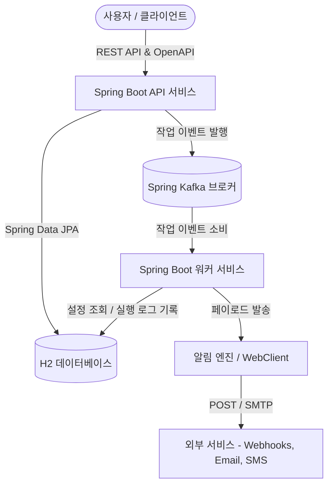
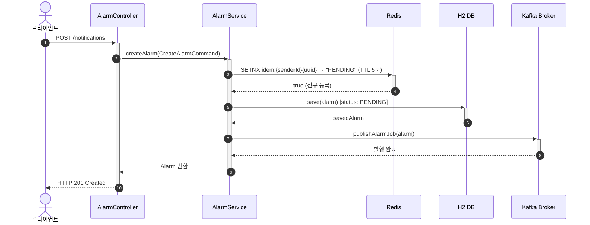
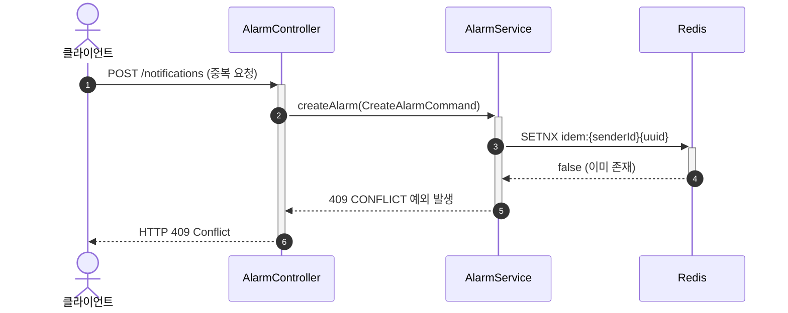
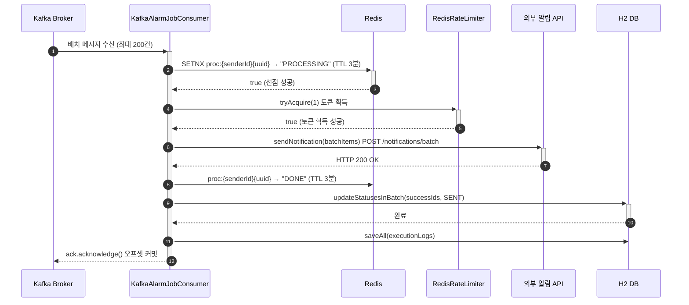
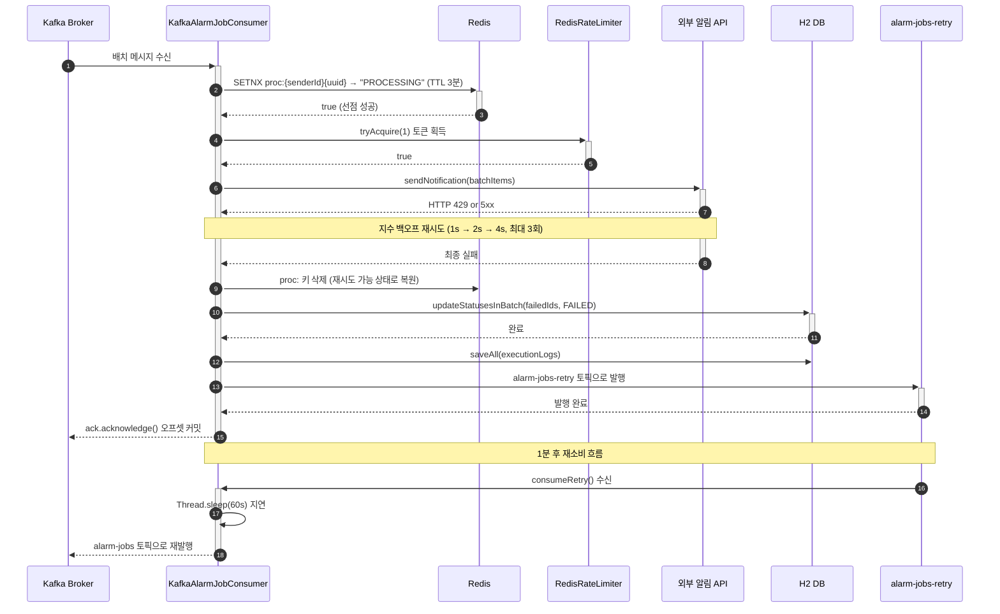

# 알림 발송 시스템

## 1. 요구사항 분석
- **기능**: 알림 API, Kafka 연동
  - 알림 신규 생성 및 발송 접수 기능 제공 (Spring Boot API Service, `/notifications` 엔드포인트)
  - 즉시 발송 중심 설계
  - Kafka 기반 비동기 멱등성 제어 및 메시지 큐 연동
  - 외부 Mock API 서버 연동 (`NotificationPort` 및 `MockApiNotificationAdapter` 구현)
  - 동작 검증: 즉시 발송 및 Kafka 비동기 멱등성 연동 검증용 통합 테스트 제공 (`AlarmImmediateTriggerTest.kt`, `AlarmKafkaIntegrationTest.kt`)
- **비기능 (발굴)**:
  - 중복 발송 -> 멱등성 키: 네트워크 재시도나 중복 요청으로 인한 동일 알림의 이중 발송 방지
  - 장애 내구성 -> MQ 기반: Kafka Broker 및 재시도/DLT(Dead Letter Topic) 구성을 통해 일시적 장애 극복
  - 채널 확장성 -> 전략 패턴: Webhook, Email, SMS 등 다양한 발송 채널 추가에 유연하게 대응할 수 있도록 추상화 인터페이스 구성

---

## 2. 아키텍처 다이어그램


### 2.1. Kafka 기반 비동기 멱등성 처리 흐름
- **발행 (Producer)**: 사용자가 `POST /notifications`를 통해 알림 발송을 요청하면, `KafkaAlarmJobProducer`가 `MessageQueuePort`를 통해 알림 이벤트를 Kafka 브로커로 발행합니다.
- **소비 (Consumer)**: `KafkaAlarmJobConsumer`가 Kafka 브로커로부터 이벤트를 비동기적으로 전달받아, 중복 처리를 방지하기 위해 로컬 락 및 데이터베이스 상태 체크를 거쳐 멱등성을 보장하며 `NotificationPort`를 통해 알림을 전송합니다.

---

## 3. 시퀀스 다이어그램

### 3.1 알림 생성 및 Kafka 발행 흐름 (POST /notifications)

#### ✅ 성공 케이스 (최초 요청)



#### ❌ 실패 케이스 (중복 요청 → 409 Conflict)



### 3.2 Kafka 소비 및 외부 발송 흐름 (KafkaAlarmJobConsumer)

#### ✅ 성공 케이스



#### ❌ 실패 케이스 (외부 API 오류 → 지수 백오프 재시도 → 재시도 토픽)



---

## 4. 주요 설계 의사결정 ⭐

주요 의사결정 흐름을 **설계, 구현, 성능, 안전성**의 4가지 범주

### 🗂️ 범주 1. 아키텍처 및 시스템 설계

#### 1.1 코드 아키텍처 선택 (헥사고날 vs 레이어드)
- **고민하게 된 구체적 문제 상황**:
  - 알림 발송 특성상 데이터베이스(JPA), 메시지 브로커(Kafka), 캐시/분산락(Redis), 외부 전송 API(Webhooks/SMS/Email) 등 수많은 인프라 연동이 필수적이었습니다.
  - 기존 레이어드 구조에서는 비즈니스 로직을 담은 Service 클래스가 이 인프라 라이브러리 객체를 직접 참조하면서 강하게 묶여, 라이브러리 버전업이나 전송 벤더 변경 시 비즈니스 도메인 코드가 요동치는 문제가 발생했습니다.
- **대안**:
  - **A안**: 전통적인 레이어드 아키텍처 (Layered Architecture)
    - *장점*: 구조가 직관적이고 스프링 부트의 기본 정석 구조라 초기 구현 속도가 매우 빠름.
    - *단점*: 비즈니스 로직(Service)이 특정 DB 프레임워크나 외부 기술 의존 모듈에 강하게 결합됨.
  - **B안**: 헥사고날 아키텍처 (Ports & Adapters)
    - *장점*: 핵심 도메인을 기술 영역과 완벽히 격리하여 JPA, Kafka, Redis 등 인프라 변경에 유연하게 대응 가능함.
    - *단점*: 보일러플레이트 코드 및 파일 개수가 늘어남.
- **결정**: B안 (헥사고날 아키텍처). 외부 메시지 큐, 캐시/분산락 등 기술 종속성을 도메인과 완벽히 격리하기 위함.
- **포기한 것**: 초기 폴더 구조의 단순함 및 초기 개발 생산성.

#### 1.2 발송 채널 확장성 패턴 (전략 + 팩토리)
- **고민하게 된 구체적 문제 상황**:
  - 초기에는 카카오톡 비즈니스 알림톡만 발송하던 서비스에 SMS, 푸시 알림, 이메일, Webhook 채널이 추가로 연동되어야 하는 상황이었습니다.
  - 발송 서비스 내부에 `if (type == KAKAO) ... else if (type == SMS)` 형태의 분기문이 무한히 늘어나기 시작했고, SMS 전송 로직의 예외 수정이나 폰트 규격 파싱 등의 수정 과정에서 기존에 잘 돌던 카카오톡 발송 로직까지 실수로 변경해 장애를 일으키는 위험에 노출되었습니다.
- **대안**:
  - **A안**: 단일 발송 서비스 내 분기(if-else) 처리
    - *장점*: 코드가 단일 지점에 모여 있어 단순 흐름을 빠르게 한눈에 읽을 수 있음.
    - *단점*: 발송 수단이 추가될 때마다 검증된 기존 코드 변경이 발생하여 회귀 버그 위험이 높아짐.
  - **B안**: 전략 패턴 + 스프링 빈 팩토리 패턴
    - *장점*: 채널 공통 포트의 다형성을 활용하여 검증된 코드 손대지 않고 새 채널 연동 어댑터만 손쉽게 추가 가능함.
    - *단점*: 파일의 개수가 늘어나며 코드 실행 동적 추적이 조금 번거로움.
- **결정**: B안 (전략 패턴 + 스프링 빈 팩토리 패턴). 기존 검증된 코드의 변경 없이 신규 발송 클래스만 추가하여 유연하게 확장하기 위함.
- **포기한 것**: 코드 가시성 (하나의 파일 내에서 흐름을 모아보는 단순함).

---

### 💻 범주 2. 도메인 및 객체 구현

#### 2.1 도메인 모델링 방식 (풍부한 도메인 vs 빈약한 도메인)
- **고민하게 된 구체적 문제 상황**:
  - 알람 생명주기는 생성 시 `PENDING`, 임시 상태 `PROCESSING`, 최종 상태 `DONE`/`FAIL`의 전이 규칙을 엄격히 준수해야 합니다.
  - 빈약한 도메인(DTO 형태)을 유지할 경우, 여러 개발자가 협업하며 비즈니스 로직을 구현하는 도중 도메인 상태 검증을 누락하여 이미 완료(`DONE`)된 알람의 상태를 다시 `PROCESSING`으로 바꾸어 외부 API로 재전송하는 버그 상황이 실제 발생 가능했습니다.
- **대안**:
  - **A안**: 빈약한 도메인 모델 (Anemic Domain Model)
    - *장점*: DB 매핑 데이터 클래스를 직접 getter/setter로 다뤄 단순 구현이 쉽고 빠름.
    - *단점*: 도메인 규칙 및 유효성 검증이 서비스 레이어 곳곳에 분산되어 객체 정합성이 쉽게 무너짐.
  - **B안**: 풍부한 도메인 모델 (Rich Domain Model / Tactical DDD)
    - *장점*: 도메인 객체 내부 메서드(`alarm.trigger()`, `alarm.fail()`)를 통해서만 상태 변경을 수행하도록 캡슐화하여 비즈니스 규칙 오염을 완전히 막음.
    - *단점*: 객체 변환 오버헤드와 도메인 모델 설계에 들어가는 러닝커브가 존재함.
- **결정**: B안 (풍부한 도메인 모델). 도메인 메서드를 통해 비즈니스 지식이 도메인 외부로 유출되는 것을 차단하기 위함.
- **포기한 것**: DB 테이블 컬럼 정보를 그대로 Getter/Setter로 다루는 단순한 데이터 전달 방식.

#### 2.2 객체 생성 방식 (기본 생성자 vs 정적 팩토리 메서드)
- **고민하게 된 구체적 문제 상황**:
  - 알람 객체는 발송 주체 식별자(`senderId`), 수신자 식별자(`receiverId`), 멱등키(`requestId`) 등의 필수 필드가 절대 누락되거나 빈 문자열이어서는 안 됩니다.
  - 코틀린의 퍼블릭 생성자 호출 방식을 무방비하게 노출하면, 외부 테스트 코드나 임시 어댑터 개발 과정에서 실수로 `requestId`를 빈 문자열로 넣은 불안정한 알람 객체가 DB에 그대로 insert되는 정합성 붕괴 상황에 부딪혔습니다.
- **대안**:
  - **A안**: 퍼블릭 기본 생성자 직접 호출
    - *장점*: 가장 기본적이고 가벼운 인스턴스화 문법을 사용해 간결하게 작성 가능함.
    - *단점*: 생성 시점의 값 유효성 체크가 강제되지 않아 불완전한 상태의 도메인 인스턴스가 유통될 수 있음.
  - **B안**: 정적 팩토리 메서드 패턴 (Static Factory Method)
    - *장점*: 메서드 이름에 생성의 비즈니스적 의도를 입히고, 내부 검증문(`require`)을 반드시 통과해야만 올바른 인스턴스를 반환하여 완벽한 객체를 보장함.
    - *단점*: 생성자를 닫고 `companion object` 팩토리를 구성해야 하므로 코드 구조가 다소 늘어남.
- **결정**: B안 (정적 팩토리 메서드 패턴). 팩토리 내부 검증 코드를 통과해야만 인스턴스를 반환하여 생성 순간부터 유효함을 보장하기 위함.
- **포기한 것**: 생성자 직접 호출 문법의 간결함.

---

### ⚡ 범주 3. 대용량 트래픽 및 성능 조율

#### 3.1 즉시 발송 아키텍처 설계 (API 접수와 실제 처리의 분리)
- **고민하게 된 구체적 문제 상황**:
  - **[프로세스 단계: 최초 클라이언트 API 요청 진입부]**
  - 마케터가 브라우저 화면에서 대규모 고객 대상 '발송 버튼'을 클릭하면, 서버 측에서는 즉시 접수 완료를 알리고 브라우저 스피너를 꺼야 합니다.
  - 만약 하나의 요청 안에서 동기적으로 카카오톡 연동 API 호출 및 대기, H2 데이터베이스 이력 update 트랜잭션을 전부 처리하려 하자, 마케터는 화면이 멈춘 채 수 초 동안 먹통 화면을 대기해야 했고, API 서버의 스레드 풀이 순식간에 고갈되어 서비스가 뻗는 부하를 경험했습니다.
- **대안**:
  - **A안**: API 서버 내부 스레드에서 외부 전송 API 완료까지 동기적으로 처리 (RDB에 바로 락 잡고 진행)
    - *장점*: 별도의 복잡한 인프라가 필요 없이 빠르게 구현 가능.
    - *단점*: 외부 API 서버 장애나 대량 요청 시 백엔드 스레드가 모두 차단되어 서버 전체가 마비될 위험이 큼.
  - **B안**: 요청 접수(API)와 실제 처리(Worker)를 분리하고, 메시지 브로커로 중간에서 버퍼링
    - *장점*: 0.1~0.5초 이내 즉각 응답이 가능하고, 실제 무거운 전송 연산은 백그라운드 워커가 조율하여 백엔드 부하를 최소화함.
    - *단점*: 메시지 브로커(Redis/Kafka) 인프라 구축 및 비동기 처리 복잡도 증가.
- **결정**: B안 (접수와 실제 처리 분리). 즉시 응답 요구사항 충족과 고부하 분산을 위해 MQ를 통한 비동기 처리가 적절하므로 채택함.
- **포기한 것**: 발송 성공/실패 여부를 API 호출 결과로 즉시 반환받는 단순성.

#### 3.2 클라이언트 중복 요청 방지 검증 기술 (Redis vs RDB)
- **고민하게 된 구체적 문제 상황**:
  - **[프로세스 단계: 최초 API 진입 및 중복 검증부]**
  - 마케터가 전송 결과가 느리다고 판단하여 마우스 클릭을 0.1초 사이에 3~4번 연달아 누르거나, 클라이언트 모바일 기기의 일시적 네트워크 끊김 후 재시도로 동일 요청이 연속 전입되는 상황이 빈번했습니다.
  - 이 요청들이 스프링 다중 인스턴스로 분배되면서, RDB에 unique 제약 조건을 걸어 중복 삽입을 막으려 하자, 동시에 insert 쿼리가 몰리며 RDB 커넥션 풀이 대기 상태에 빠지고 테이블 전체에 락(Lock)이 걸려 DB 성능이 급격히 무너지는 병목 현상이 일어났습니다.
- **대안**:
  - **A안**: RDB 테이블에 UNIQUE 제약조건을 걸거나 SELECT FOR UPDATE 락을 활용해 멱등키 검증
    - *장점*: 별도의 인프라 없이 단순 구현 가능.
    - *단점*: 트래픽이 몰릴 때 디스크 I/O 락 대기 및 커넥션 풀 고갈로 RDB 서버 전체가 먹통이 됨.
  - **B안**: Redis에 `Idempotency-Key`(`idem:{senderId}{uuid}`)를 적재하여 멱등성 검사
    - *장점*: 메모리 상에서 원자적 싱글 스레드로 처리해 엄청나게 가볍고 빠르며, TTL(예: 5분)을 두어 자동으로 만료 삭제 가능.
    - *단점*: Redis 추가 관리에 따른 인프라 비용 발생.
- **결정**: B안 (Redis 멱등 검사). 대량 트래픽 상황에서 RDB의 스케일 아웃 한계를 넘어서고 부하를 완벽히 분산하기 위해 Redis로 분리함.
- **포기한 것**: 트랜잭션 안에서 RDB 하나로 모든 데이터 정합성을 한 번에 묶는 데이터 처리의 단순성.

#### 3.3 카프카 비동기 분산 시 순차 처리 및 핫파티션 회피 파티션 키 설계
- **고민하게 된 구체적 문제 상황**:
  - **[프로세스 단계: API 서버 -> Kafka 큐 적재 발행부]**
  - 카프카 브로커에 10개의 파티션이 띄워진 상태에서, 단일 발송 마케터(예: 대형 할인 이벤트 마케터)가 순간적으로 10만 건의 알림 발송을 요청했습니다.
  - 파티션 키를 단순 `userId`로 지정하면 특정 파티션 한 곳으로만 10만 건이 몰리는 '핫파티션' 현상이 벌어져 10개 컨슈머 인스턴스 중 단 1개만 부하를 감당하고 나머지 9개는 노는 비효율적인 분산 불균형이 초래되었습니다. 반대로 채널(`channelId`)을 키로 잡으면 카카오톡 서버의 일시 연체 장애가 다른 멀쩡한 SMS 채널 전송까지 큐 대기열에 묶이게 만들었습니다.
- **대안**:
  - **A안**: `userId`(발송자/마케터 ID)를 파티션 키로 사용
    - *장점*: 특정 발송자가 순서대로 전송 가능.
    - *단점*: 한 발송자가 수십만 건을 연속 발송할 때 하나의 파티션에만 큐가 적체되는 핫파티션 발생.
  - **B안**: `channelId`(발송 채널)를 파티션 키로 사용
    - *장점*: 채널 단위 관리가 간편함.
    - *단점*: 카카오톡 등 특정 채널에 과부하/장애가 나면 그 뒤의 카톡 메시지들이 모두 막힘.
  - **C안**: `senderId` + `receiverId` 조합을 파티션 키로 사용
    - *장점*: 데이터가 균등하게 여러 파티션에 골고루 분배되며, 동일 수신자 방향의 중복 발송을 깔끔하게 차단 및 순차 처리 가능.
    - *단점*: 파티션 키 연산에 들어가는 소폭의 문자열 합성 리소스.
- **결정**: C안 (`senderId` + `receiverId` 조합). 핫파티션을 회피하며 메시지 1/N 밸런싱을 유도하기 위해 채택함.
- **포기한 것**: 단순 도메인 엔티티 ID 하나만 파티션 키로 지정하는 직관성.

#### 3.4 외부 연동 API 서버 보호를 위한 전송 빈도 조율 (Rate Limiting)
- **고민하게 된 구체적 문제 상황**:
  - **[프로세스 단계: 컨슈머 워커 -> 외부 API 연동 호출부]**
  - 대량 알림 메시지가 카프카 컨슈머를 통해 고속으로 소비되며 외부 알림 통신사 API 서버로 초당 수만 건씩 쏟아져 나가기 시작했습니다.
  - 통신사 측 API 제한 규정인 초당 500건 한도를 미처 고려하지 않아 상대 서버로부터 차단(HTTP 429 Too Many Requests) 통보를 받아 알람이 전량 실패 처리되거나, 일시적으로 차단 풀릴 때까지 불필요하게 통신사에 연타 호출(고백 공격)을 날리며 네트워크 대역폭만 소모하는 문제가 있었습니다.
- **대안**:
  - **A안**: 외부 API 서버의 에러 응답을 실시간으로 추적하며 Thread Sleep 등으로 동적으로 속도를 지연시킴
    - *장점*: 추가 라이브러리 도입 불필요.
    - *단점*: 스레드가 블로킹되어 불필요한 시스템 리소스 대기 발생.
  - **B안**: Kafka Batch Listener를 적용하고, Redis 연동형 Bucket4j를 통해 공유 토큰 버킷으로 속도를 제한
    - *장점*: 초당 최대 500회 호출 및 1회 호출당 최대 200건 단위의 배치 전송 규칙을 클러스터 레벨에서 안전하게 공유하여 제어함.
    - *단점*: Bucket4j 설정 및 배치 전송 처리를 위한 추가 연동 필요.
- **결정**: B안 (Kafka Batch Listener + Redis Bucket4j). 상대 API 서버의 부하 한계 속도에 동적으로 부합하도록 하여 429 차단을 원천 방지하기 위해 채택함.
- **포기한 것**: 단건 발송용 단순 API 통신 아키텍처.

---

### 🛡️ 범주 4. 시스템의 안정성과 예외 복구

#### 4.1 메시지 영속성 저장 매체 선택 (Redis vs Kafka)
- **고민하게 된 구체적 문제 상황**:
  - **[프로세스 단계: 대기열 메시지 버퍼링부]**
  - 비동기 알림 시스템을 구동하던 도중, 예기치 않은 순간에 메시지 큐 장비에 전원 차단이나 하드웨어 장애 크래시가 발생했습니다.
  - 메모리 버퍼 방식의 대기열을 사용하던 상황에서는 Redis 내부 메모리가 초기화되어 발송되지 못한 5만 건의 고객 알람 정보가 공중 분해되었고, 수동으로 재현하거나 유실분을 탐색하기 매우 곤란한 데이터 신뢰성 문제가 발생했습니다.
- **대안**:
  - **A안**: Redis (인메모리 데이터 구조 저장소)
    - *장점*: 인메모리 방식이라 속도가 극도로 빠름.
    - *단점*: Redis가 예기치 않게 종료되는 경우, 메모리에만 보관되던 메시지가 소실되어 알림 누락 발생.
  - **B안**: Kafka (디스크 커밋 로그 기반 저장소)
    - *장점*: 메시지를 디스크에 영구 저장하여 장애 발생 시에도 컨슈머가 과거 오프셋부터 다시 읽어서 안전하게 재처리 가능.
    - *단점*: 초기 설정 인프라 리소스가 다소 큼.
- **결정**: B안 (Kafka). 장애 복구 및 메시지 재처리를 가능케 해 알림 유실을 원천적으로 막기 위해 디스크 기반 영구 저장을 보장하는 Kafka를 채택함.
- **포기한 것**: 인메모리 완전 초고속 처리성능 및 Redis 단일 인프라 구성의 간결함.

#### 4.2 동시성 및 중복 제어 엔진 선택 (Redis 분산 락 vs Kafka 큐)
- **고민하게 된 구체적 문제 상황**:
  - **[프로세스 단계: 이벤트 소비 제어부]**
  - 분산 클러스터 환경에서 API 노드가 다수일 때 마케터의 클릭 난타로 인해 동일한 UUID 멱등키를 가진 중복 이벤트 메시지 5개가 비동기 큐에 연이어 밀려 들어왔습니다.
  - 이를 방지하기 위해 Redis 분산 락을 걸고 동기 검증을 돌렸더니, 외부 네트워크 딜레이 시간 동안 스레드가 모두 락 획득을 위해 락 대기 상태로 block되어 WAS 커넥션 풀 전체가 막히고 동기 응답이 전면 마비되는 장애 현상에 직면했습니다.
- **대안**:
  - **A안**: Redis 분산 락 기반 동기 제어
    - *장점*: API 요청 즉시 최종 전송 완료 여부를 동기적으로 알아차리기 용이함.
    - *단점*: 외부 API 서버 장애 등으로 지연 시 락 대기 및 WAS 스레드 풀 전체 고갈 위험이 큼.
  - **B안**: Kafka 파티션 키 기반 비동기 순차 제어
    - *장점*: 멱등키를 파티션 키로 하여 단일 파티션에 정렬해 처리함으로써 락 필요성을 제거하고, 디스크 로그 영속성으로 유실율을 0%에 수렴시킴.
    - *단점*: API 응답 시점에 결과를 반환할 수 없어 접수 응답만 나가므로 비동기 조회 처리가 동반되어야 함.
- **결정**: B안 (Kafka 파티션 키 기반 비동기 순차 제어). 멱등성 키(`requestId`)를 카프카 파티션 키로 하여 단일 파티션으로 순차 정렬하고, 디스크 영속성을 통해 장애 복구 시에도 메시지 유실율을 0%에 수렴시키기 위함.
- **포기한 것**: API 호출 시점의 동기식 발송 완료 상태 반환.

#### 4.3 공통 자원 제어 패턴 (AOP 프록시 vs 템플릿/콜백)
- **고민하게 된 구체적 문제 상황**:
  - **[프로세스 단계: 데이터 정합성 보장 락 획득부]**
  - 동일한 알림 요청에 대한 중복 처리 방지를 목적으로 스프링 AOP 기반 `@DistributedLock`과 같은 커스텀 어노테이션을 만들어 락 제어를 적용했습니다.
  - 그런데 내부 클래스 메서드 호출(Self-Invocation) 시 스프링 프록시의 물리적 한계로 락 획득 로직이 우회되어 분산 락 없이 메서드가 동시 통과했고, 락 반납 시점과 트랜잭션 커밋 완료 간의 타이밍 레이스 컨디션이 생기면서 간헐적으로 중복 발송을 막아내지 못하는 원인 미상의 간헐적 데이터 꼬임 장애를 겪었습니다.
- **대안**:
  - **A안**: 스프링 AOP 프록시 기반 Custom Annotation
    - *장점*: 비즈니스 로직 상단에 어노테이션 한 줄로 끝나 가독성이 뛰어남.
    - *단점*: 내부 호출(Self-Invocation) 시 프록시가 작동하지 않아 락이 걸리지 않고, 트랜잭션 커밋 전에 락이 먼저 반납되어 중복 정합성이 깨지는 문제가 있음.
  - **B안**: 템플릿/콜백 패턴 (LockTemplate + Kotlin Lambda)
    - *장점*: 내부 자가 호출 문제를 원천 방지하며, 락의 시작과 끝, 데이터 커밋 시점을 컴파일러 수준에서 안전하게 통제함.
    - *단점*: 핵심 비즈니스 로직이 중첩된 람다 블록 내부에 갇혀 인덴트가 깊어짐.
- **결정**: B안 (템플릿/콜백 패턴). 자가 호출(Self-Invocation) 문제를 원천 차단하고 락 획득/반납 경계를 컴파일러 수준에서 제어하기 위함.
- **포기한 것**: 어노테이션 기반 선언형 코드 가독성.

#### 4.4 카프카 최소 1회 전송(At-least-once)에 따른 중복 소비 극복 전략
- **고민하게 된 구체적 문제 상황**:
  - **[프로세스 단계: 컨슈머 워커 중복 발송 방지부]**
  - 카프카 컨슈머 A가 특정 메시지를 정상 수신하여 외부 전송사 API를 성공적으로 태운 뒤, 브로커에 오프셋 커밋(ACK)을 날리려는 순간에 갑작스러운 컨슈머의 OOM 크래시나 네트워크 일시 단절이 일어났습니다.
  - 카프카 브로커는 해당 메시지가 소비되지 않았다고 판단(At-least-once 전송 조건)하여 대체 컨슈머 B에게 동일 메시지를 재할당했고, 컨슈머 B는 이전에 컨슈머 A가 이미 발송을 완료한 사실을 모른 채 동일 고객에게 중복 발송을 개시하여 마케터로부터 고객 항의(알림 폭탄)를 접수받는 문제가 발생했습니다.
- **대안**:
  - **A안**: H2 데이터베이스 이력의 PENDING/DONE 상태 전이에 의존하여 중복 체크
    - *장점*: 비즈니스 로직과 함께 원자적 처리가 용이함.
    - *단점*: 여러 컨슈머 인스턴스가 동시에 select 시 레이스 컨디션이 생기거나, 락에 의한 성능 저하 발생.
  - **B안**: Redis에서 `SETNX`를 활용해 진행 상태 키(`proc:{senderId}{uuid}`)를 선점
    - *장점*: `PROCESSING` 상태로 먼저 선점하여 다른 컨슈머의 중복 트리거를 완벽하게 배제하고, 발송 성공 후 `DONE` 상태로 원자적 갱신 가능. TTL(3분)을 통해 자원 회수 보장.
    - *단점*: 분산 시스템 구성 간 상태 관리를 전적으로 캐시 인프라에 의존.
- **결정**: B안 (Redis `SETNX` 기반 진행 선점). 네트워크 타임아웃 및 컨슈머 재할당 과정에서 발생할 수 있는 중복 트리거를 확실히 차단하기 위해 채택함.
- **포기한 것**: Redis 미연동 시 로컬 메모리 상태에만 의존하는 가벼움.

#### 4.5 외부 에러(429/503 등) 복구 및 사후 실패 처리
- **고민하게 된 구체적 문제 상황**:
  - **[프로세스 단계: 발송 최종 결과 갱신부]**
  - 외부 통신사 API 서버가 순간적인 네트워크 지연이나 임시 점검 등으로 2~3초간 일시 불능 상태에 빠졌습니다.
  - 컨슈머가 외부 API 호출 실패 예외를 감지하자마자 단순 예외 처리로 DB 이력을 곧바로 전송 실패(`FAIL`) 처리하면서 1만 건의 유효 알림이 일시적 장애 때문에 최종 영구 유실(미발송) 처리되어 고객 도달율이 하락하는 현실적인 문제를 겪었습니다.
- **대안**:
  - **A안**: 에러 발생 즉시 DB 상태를 FAIL로 변경하고 종료한 후 관리자가 수동으로 재처리함
    - *장점*: 시스템 로직이 가장 단순함.
    - *단점*: 사소한 장애에도 알림 유실이 많이 생겨 운영 공수가 매우 큼.
  - **B안**: 지수 백오프(Exponential Backoff) 패턴으로 즉시 대기 시간을 2배씩(1초, 2초, 4초...) 늘리며 재시도하고, 최종 실패 시 `@RetryableTopic`/DLT로 우회하여 1분 뒤 재소비 시도
    - *장점*: 일시적인 네트워크 순간 장애는 지수 백오프 선에서 서버 지연 없이 100% 자동 복구됨.
    - *단점*: 비동기 재시도 큐 관리 복잡도가 증가함.
- **결정**: B안 (지수 백오프 및 재시도 토픽 구성). 인프라의 장애 내구성(Fault Tolerance)을 극대화하여 무장애 운영을 가능케 하기 위해 채택함.
- **포기한 것**: 장애 발생 시의 실시간 동기적 즉시 에러 피드백 반환.

---

## 5. 한계 · 추후 개선
- **서킷 브레이커 도입**: 외부 서비스 장애가 워커 전체로 전파되지 않도록 Resilience4j 서킷 브레이커를 결합하여 장애 전파를 차단합니다.

---

## 6. 로컬 실행 방법
Zookeeper 및 Kafka 환경을 Docker Compose를 활용해 기동한 후 애플리케이션을 테스트할 수 있습니다.
1. **Kafka 컨테이너 실행**:
   프로젝트 루트 경로에서 아래 명령을 통해 백그라운드로 Kafka 브로커를 띄웁니다.
   ```bash
   docker-compose up -d
   ```
2. **애플리케이션 실행**:
   ```bash
   ./gradlew bootRun
   ```
3. **전체 통합 테스트 실행**:
   ```bash
   ./gradlew test
   ```