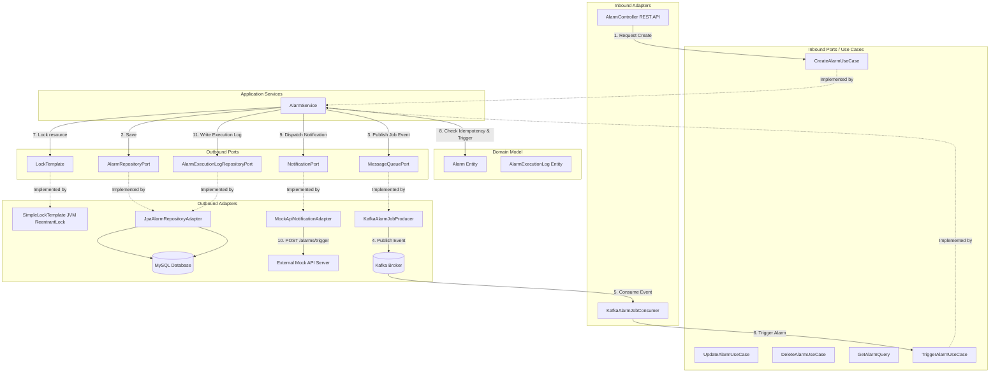

# Alarm API - Architecture Documentation

## 1. System Overview
The Alarm API is designed to manage and trigger user-defined alarms immediately. The system is architected as a **Hexagonal Architecture (Ports and Adapters)** to decouple core business logic from database systems, API frameworks, and external services.

---

## 2. Technical Stack
The application is built on a modern, event-driven JVM stack:
- **Language**: Kotlin 1.9.25 (Java 21 toolchain)
- **Framework**: Spring Boot 3.5.14 (Gradle build tool)
- **Database Access**: Spring Data JPA (Hibernate) with MySQL for metadata persistence, and H2 for local test/runtime fallback.
- **Messaging/Broker**: Spring Kafka for distributing alarm execution jobs asynchronously.
- **Cache & Distributed Locking**: Spring Data Redis for fast lock-management or caching (Planned).
- **API Documentation**: Springdoc OpenAPI (`springdoc-openapi-starter-webmvc-ui` 2.8.16).
- **Monitoring**: Spring Boot Actuator for health checks and metrics.

---

## 3. Package & Directory Structure (Hexagonal Architecture)
The project is strictly organized into `domain`, `application`, and `adapter` packages:

```
c:\project\alarm_api\
├── build.gradle.kts
├── src/
│   ├── main/
│   │   ├── kotlin/
│   │   │   └── com/alarm/
│   │   │       ├── AlarmApplication.kt
│   │   │       ├── config/                  # Configuration Layer (Spring Configurations)
│   │   │       │   └── KafkaConfig.kt
│   │   │       ├── domain/                  # 1. Core Domain Layer (No Spring/Framework Dependencies)
│   │   │       │   ├── Alarm.kt
│   │   │       │   ├── AlarmExecutionLog.kt
│   │   │       │   └── AlarmStatus.kt
│   │   │       ├── application/             # 2. Application Layer (Use Cases, Services, & Ports)
│   │   │       │   ├── port/
│   │   │       │   │   ├── in/              # Inbound Ports (Use Cases / Queries)
│   │   │       │   │   │   ├── CreateAlarmUseCase.kt
│   │   │       │   │   │   ├── DeleteAlarmUseCase.kt
│   │   │       │   │   │   ├── GetAlarmQuery.kt
│   │   │       │   │   │   ├── TriggerAlarmUseCase.kt
│   │   │       │   │   │   └── UpdateAlarmUseCase.kt
│   │   │       │   │   └── out/             # Outbound Ports (SPIs)
│   │   │       │   │       ├── AlarmRepositoryPort.kt
│   │   │       │   │       ├── AlarmExecutionLogRepositoryPort.kt
│   │   │       │   │       ├── LockTemplate.kt
│   │   │       │   │       ├── MessageQueuePort.kt
│   │   │       │   │       └── NotificationPort.kt
│   │   │       │   └── service/             # Application Services (Transaction boundaries)
│   │   │       │       └── AlarmService.kt
│   │   │       └── adapter/                 # 3. Adapter Layer (Web REST, DB Persistence, Infrastructure)
│   │   │           ├── in/
│   │   │           │   ├── messaging/       # Inbound Messaging (Kafka Consumer)
│   │   │           │   │   └── KafkaAlarmJobConsumer.kt
│   │   │           │   └── web/             # Inbound Web Controllers & DTOs
│   │   │           │       ├── AlarmController.kt
│   │   │           │       └── dto/
│   │   │           │           └── AlarmDto.kt
│   │   │           └── out/
│   │   │               ├── lock/            # Outbound Locking Adapter (Template/Callback)
│   │   │               │   └── SimpleLockTemplate.kt
│   │   │               ├── messaging/       # Outbound Messaging (Kafka Producer)
│   │   │               │   └── KafkaAlarmJobProducer.kt
│   │   │               ├── notification/    # Outbound Notification Adapter (Mock API Client)
│   │   │               │   └── MockApiNotificationAdapter.kt
│   │   │               └── persistence/     # Outbound JPA Persistence Adapter
│   │   │                   ├── JpaAlarmRepositoryAdapter.kt
│   │   │                   ├── JpaAlarmExecutionLogRepositoryAdapter.kt
│   │   │                   ├── entity/      # JPA Hibernate Entities
│   │   │                   │   ├── AlarmEntity.kt
│   │   │                   │   └── AlarmExecutionLogEntity.kt
│   │   │                   └── repository/  # Spring Data JPA Interfaces
│   │   │                       ├── SpringDataAlarmRepository.kt
│   │   │                       └── SpringDataAlarmExecutionLogRepository.kt
│   │   └── resources/
│   │       └── application.properties
│   └── test/                                # Integration & Verification Tests
│       └── kotlin/
│           └── com/alarm/
│               ├── AlarmApplicationTests.kt
│               ├── adapter/in/web/AlarmControllerTest.kt
│               ├── domain/AlarmTest.kt
│               └── grading/                 # Grader Verification Suite
│                   ├── AlarmImmediateTriggerTest.kt
│                   └── AlarmKafkaIntegrationTest.kt
```

---

## 4. Architectural Components & Patterns

### 4.1. Core Domain Layer (`com.alarm.domain`)
The domain contains pure Kotlin models, completely independent of database mappings or external frameworks. It is designed specifically for **Immediate Alarm Triggering (즉시 발송 알림)**, containing no scheduling parameters like `scheduledAt` or cron expressions.

*   **Static Factory Methods**: Instantiation is routed through semantic factory methods to enforce business constraints:
    *   `Alarm.create(name, payload)`: Enforces business rules (e.g., name cannot be blank) and sets the initial state to `ACTIVE`.
    *   `Alarm.reconstruct(...)`: Restores the aggregate state when loaded from the database persistence layer, bypassing the validation rules meant for new alarm configurations.
    *   `AlarmExecutionLog.record(...)`: Records execution outcomes (`SUCCESS`/`FAILED`).
    *   `AlarmExecutionLog.reconstruct(...)`: Reconstitutes logs from the database.
*   **Rich Behavior & Domain State Transitions**: Avoids setter operations. State logic is encapsulated inside domain methods:
    *   `activate()`, `deactivate()`, `trigger()`, `fail()`, and `update(...)`.

### 4.2. Application Layer (`com.alarm.application`)
Defines the ports (boundaries) and implements the use cases of the system.
*   **Inbound Ports (Use Cases / API boundaries)**: Expose clean operations to the web adapter:
    *   `CreateAlarmUseCase` (via `CreateAlarmCommand`)
    *   `UpdateAlarmUseCase` (via `UpdateAlarmCommand`)
    *   `DeleteAlarmUseCase`
    *   `GetAlarmQuery` (for queries/listing)
    *   `TriggerAlarmUseCase` (to execute an alarm immediately)
*   **Outbound Ports (SPIs)**: Define interface boundaries for outbound tasks:
    *   `AlarmRepositoryPort` & `AlarmExecutionLogRepositoryPort` (for database persistence)
    *   `LockTemplate` (for resource lock coordination)
    *   `NotificationPort` (for sending notifications to external systems)
    *   `MessageQueuePort` (for publishing alarm execution jobs asynchronously to the event broker)
*   **Application Services (`AlarmService`)**: Intercepts transactions, queries/updates data, coordinates business rules on domain aggregates (using `LockTemplate` for concurrency protection), publishes job events to Kafka upon alarm creation, sends notifications, and writes success/failure execution logs.

### 4.3. Adapter Layer (`com.alarm.adapter`)
Connects external clients and databases to the application domain.
*   **Inbound Web Adapter (`com.alarm.adapter.in.web`)**:
    *   **`AlarmController`**: Exposes REST endpoints mapped to `/alarms`. Fully documented with Swagger/OpenAPI annotations.
    *   `POST /alarms` -> Creates alarm rule. Returns 201 Created.
    *   `GET /alarms` -> Lists paginated alarms. Returns 200 OK.
    *   `GET /alarms/{id}` -> Retrieves alarm details. Returns 200 OK.
    *   `PUT /alarms/{id}` -> Updates configuration. Returns 200 OK.
    *   `DELETE /alarms/{id}` -> Deletes alarm. Returns 204 No Content.
    *   `POST /alarms/{id}/trigger` -> Triggers an alarm immediately. Returns 204 No Content.
*   **Inbound Messaging Adapter (`com.alarm.adapter.in.messaging`)**:
    *   **`KafkaAlarmJobConsumer`**: Listens to the `alarm-jobs` Kafka topic under consumer group `alarm-group`. Consumes the event and asynchronously invokes the `TriggerAlarmUseCase` to execute the alarm logic.
*   **Outbound Persistence Adapter (`com.alarm.adapter.out.persistence`)**: Adapts JPA Entities (`AlarmEntity`, `AlarmExecutionLogEntity`) to/from Domain entities (`Alarm`, `AlarmExecutionLog`). Implements the Repository Ports and delegates to standard Spring Data JpaRepository interfaces.
*   **Outbound Messaging Adapter (`com.alarm.adapter.out.messaging`)**:
    *   **`KafkaAlarmJobProducer`**: Implements the `MessageQueuePort` by sending the `alarmId` to the `alarm-jobs` Kafka topic. It specifies the `alarmId` as the record partition key to route related events to the same partition, assuring order of execution and scaling out worker nodes securely.
*   **Outbound Notification Adapter (`com.alarm.adapter.out.notification`)**:
    *   **Port (`NotificationPort`)**: Interface defining the contract for dispatching alarm notifications to external services.
    *   **Adapter (`MockApiNotificationAdapter`)**: Integrates with an external Mock API server to simulate notification dispatch. Validates connection parameters and logs dispatch attempts.
*   **Template / Callback Locking Pattern (`com.alarm.adapter.out.lock`)**:
    *   **Port (`LockTemplate`)**: Defines a generic template/callback method `<T> executeWithLock(lockKey, action: () -> T): T`.
    *   **Adapter (`SimpleLockTemplate`)**: Implements JVM concurrency control using thread-safe `ReentrantLock` map (`ConcurrentHashMap`) to lock alarm resources safely during updates or deletions. This abstraction allows easy swaps to Redis-based distributed locks in production without code modifications to the `AlarmService`.

---

## 5. System Architecture Flow
The dependency direction always points **inward** toward the application core and domain.



---

## 6. Architectural Quality Attributes & Design Decisions
- **Decoupled Architecture**: Decoupling the Domain using DTO/Entity mapping adapters prevents database schemas from dictating domain constraints.
- **Asynchronous Execution**: Publishing events on Kafka decouples fast client request responses from API notification wait times.
- **Idempotency Control**: In `AlarmService.triggerAlarm()`, state transition logic checks if the alarm status is already `TRIGGERED`. If so, it returns immediately (skipping notification dispatch and logging), shielding the system from Kafka redeliveries or concurrent duplicate processing.
- **Concurrency Isolation**: The Template/Callback concurrency control protects resources via partition-level ordering and thread-safe locking during critical updates, triggers, and deletes.
- **Partition Key-Based Route**: Specifying the `alarmId` as the Kafka partition key routes all execution events for a given alarm to the same consumer partition, guaranteeing strict order of execution and eliminating race conditions.

---

## 7. Verification & Grading Tests
To facilitate automatic testing and validation of the system, the following test suites have been established:
- **`AlarmImmediateTriggerTest.kt`** (located at `src/test/kotlin/com/alarm/grading/AlarmImmediateTriggerTest.kt`):
  - Validates full end-to-end integration via `MockMvc`.
  - Simulates creating an alarm, executing the immediate trigger endpoint `POST /alarms/{id}/trigger`, and verifying the status updates dynamically to `TRIGGERED`.
  - Employs Mockito on the outbound `NotificationPort` to ensure external REST mock API requests are successfully dispatched when the trigger runs.
- **`AlarmKafkaIntegrationTest.kt`** (located at `src/test/kotlin/com/alarm/grading/AlarmKafkaIntegrationTest.kt`):
  - Validates asynchronous execution and idempotency control using `@EmbeddedKafka` (3 partitions, topic: `alarm-jobs`).
  - Assures that when an alarm is created via `POST /alarms`, a job event is published to Kafka, consumed by `KafkaAlarmJobConsumer`, and the alarm status changes automatically to `TRIGGERED` while dispatching notifications asynchronously within a timeout window.
